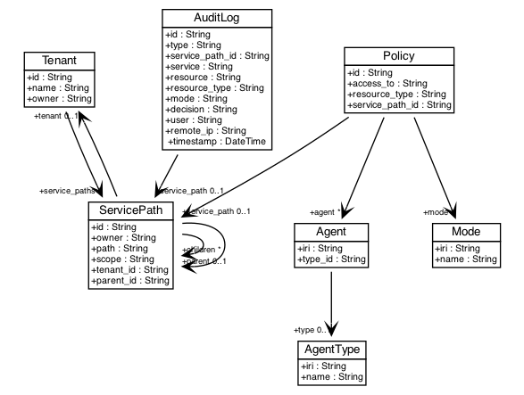

# Data model

Anubis data model is depicted in the figure below.

The data model is generated from SQLAlchemy database models using
[sqlalchemy_schemadisplay](https://pypi.org/project/sqlalchemy_schemadisplay/).
