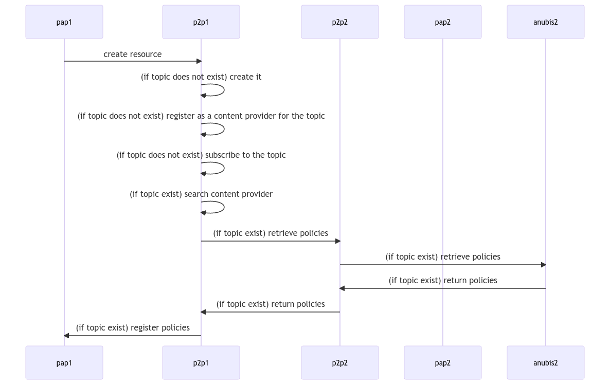

# Welcome to Anubis

Anubis is a flexible Policy Enforcement solution
that makes easier to reuse security policies across different services,
assuming the policies entail the same resource.
In short we are dealing with policy portability :) What do you mean by that?

Let's think of a user that register some data in platform A.
To control who can access his data he develops a set of policies.
If he moves the data to platform B, most probably he will have to define again
the control access policies for that data also in platform B.

Anubis aims to avoid that :) or at least simplify this as much as possible
for the data owner. How? Leveraging open source solutions (e.g.
[Envoy](https://www.envoyproxy.io/),
[OPA](https://www.openpolicyagent.org/)) and reference standards
(e.g. [W3C WAC](https://solid.github.io/web-access-control-spec/),
[W3C ODRL](https://www.w3.org/TR/odrl-model/), [OAUTH2](https://oauth.net/2/)).

Of course, the support for distributed policies management may be of value
also for a single platform deployed distributedly, e.g. to synch policies
across the cloud-edge.

## Why this project?

Data portability often focuses on the mechanisms to exchange data and the
formalisation of data representation: the emphasis is rarely put
on the portability of security & privacy data policies.
Enabling security and privacy data policy portability is clearly
a step forward in enabling data sovereignty across different services.

This project aims at enabling data sovereignty by introducing data privacy and
security policy portability and prototyping distributed data privacy
and security policy management, thus contributing to increase
trust toward data sharing APIs and platforms.

Approaches as the one proposed, increasing control by owners over their data and
portability of data assets, are key to boost the establishment of
trusted data spaces.

The project is looking into

- Open standardized security & privacy data policies vocabulary.
- Linking an existing user profiling vocabulary to the security & privacy data
    policies vocabulary as a way to increase portability of policies and their
    compatibility to existing standards.
- A middleware supporting decentralised control and audit of security & privacy
    data policies by data owners (in the context of RESTful APIs).
- Translation from the security & privacy data policies vocabulary to other
    policy languages or APIs that are actually used for PEP.

While Anubis is not subject to GDPR per se, it allows API owners to implement
effective GDPR in their solutions.

## Why did you pick Anubis as name?

[Anubis](https://en.wikipedia.org/wiki/Anubis) is an ancient Egyptian god,
that has multiple roles in the mythology of ancient Egypt. In particular,
we opted for this name, because he decides the fate of souls:
based on their weights he allows the souls to ascend to a heavenly existence,
or condemn them to be devoured by Ammit. Indeed, Anubis was a Policy Enforcement
system for souls :)

## State of the art and standards

In the design and development of Anubis we tried to leverage different
state-of-the-art solutions and standards:

- [[W3C WAC](https://solid.github.io/web-access-control-spec/), one of the
  reference vocabularies for expressing access control policies over web
  resources.
- [W3C ODRL](https://www.w3.org/TR/odrl-model/), a policy expression language
  that allows representing statements about the usage of
  content and services.
- [OAUTH2](https://oauth.net/2/)) and [OIDC](https://openid.net/connect/)
  the today reference protocols for authentication.
- [OPA](https://www.openpolicyagent.org/) the state of the art solution
  for cloud native policy evaluation (not necessarily applied to access
  control).

To an extent, Anubis' approach is comparable to [MyData](https://developer.mydata-control.de/)
Framework by Fraunhofer IESE. The main differences are:

- Anubis focuses on policy portability, and because of that, the starting point
  to express policies are existing vocabularies targeting interoperability,
  not a [new policy language](https://developer.mydata-control.de/language).
- Anubis does not support data manipulation to reduce attributes or data
  elements that should not be accessed (not yet at least).
- Anubis is meant to work distributedly, while MyData takes more a centralised
  approach.
- Anubis tries to apply the principle that policies follows the data, while
  interoperability of policies and their portability are out of the scope
  of MyData.

There are also quite some similarities with [FIWARE TRUE](https://fiware-true-connector.readthedocs.io/en/latest/index.html)
by Engineering. Interestingly enough, TRUE uses ODRL for providing usage control
on top of My Data Framework in the context of IDSA. This has quite a number
of complex architectural and requirements implications, that we believe are
not suitable in scenarios where the source of trust and control is the owner
of the data, and not a central authority. Other differences resemble the ones
analyzed for My Data.

## Architecture

### Policy Enforcement

In term of policy enforcement, Anubis adopts a standard architecture:
a client request for a resource to an API, and based on the
defined policies, the client is able or not to access the resource.
The figure below shows the current architecture.

```ascii
                            ┌──────────────┐        ┌──────────────┐
                            │   Policy     │   3    │    Policy    │
                            │   Decision   ├───────►│Administration│
                            │   Point      │        │    Point     │
                            └──────────────┘        └──────────────┘
                                   ▲
                                 2 │
                                   │
    ┌──────────────┐        ┌──────┴──────┐        ┌───────────────┐
    │              │   1    │   Policy    │   4    │   Protected   │
    │    Client    ├───────►│ Enforcement ├───────►│               │
    │              │        │    Point    │        │      API      │
    └──────────────┘        └─────────────┘        └───────────────┘
```

1. A client requests for a resource via the Policy Enforcement Point (PEP) -
    implemented using an Envoy's proxy
    [authz filter](https://www.envoyproxy.io/docs/envoy/latest/start/sandboxes/ext_authz).
1. The PEP pass over the request to the PDP (Policy Decision Point), provided by
    OPA which evaluates a set of rules that apply the abstract policies to the
    specific API to be protected;
1. In combination with the policies stored in the PAP (Policy Administration
    Point), provided by the Policy Management API;
1. If the evaluation of the policies returns `allowed`, then the request is
    forwarded to the Protected API.

#### Policy Management

Anubis currently supports only Role Based Access Control policies. Policies
are stored in the [Policy Management API](https://github.com/orchestracities/anubis/tree/master/anubis-management-api),
that supports the translation to WAC and to a data input format supported by
[OPA](https://www.openpolicyagent.org/), the engine that performs
the policy evaluation.

#### Policy Evaluation

The policy evaluation is performed by [OPA](https://www.openpolicyagent.org/),
combining the data stored in the Policy Management API, and a set of API
specific rule defined in [Rego](https://www.openpolicyagent.org/docs/latest/policy-language/)
(OPA's native query language).

The role of Rego's rules is to apply policies that are API independent -
policies identify their objects using [Uniform Resource Name](https://en.wikipedia.org/wiki/Uniform_Resource_Name)
to define a unique identifier for data (as envisioned by NGSI-LD) - to
the specific format of an API.

For example, we may have a policy that states
*anyone authenticated can read urn:mycool:resource*:

```text
    @prefix acl: <http://www.w3.org/ns/auth/acl#> .
    example:a0be6113-2339-40d7-9e85-56f93372f279 a acl:Authorization ;
        acl:accessTo urn:mycool:resource ;
        acl:accessToClass urn:mycool ;
        acl:agentClass acl:AuthenticatedAgent ;
        acl:mode acl:Read .
```

Rego's rules translate this policy to a `GET` request that contains
a valid `JWT token` the api endpoint: `http://myapi/resources/urn:mycool:resource`

A different Rego rule can be defined to work on another API using
a different authentication mechanism.

### Policy Distribution (under development)

The policy distribution architecture relies on [libp2p](https://libp2p.io/)
middleware to distribute policies across differed Policies Administration
Points. The architecture decouples the PAP from the distribution middleware to:

- Allow different PAP to share the same distribution node.
- Allow deployment without the distribution functionalities (and hence
with a smaller footprint), when this is not required.

The distribution middleware is called Policy Distribution Point.

```ascii
    ┌──────────────┐        ┌──────────────┐
    │   Policy     │        │    Policy    │
    │ Distribution │◄──────►│Administration│
    │   Point 1    │        │    Point 1   │
    └──────────────┘        └──────────────┘
           ▲
         2 │
           ▼
    ┌──────────────┐        ┌──────────────┐
    │   Policy     │        │    Policy    │
    │ Distribution │◄──────►│Administration│
    │   Point 2    │        │    Point 2   │
    └──────────────┘        └──────────────┘
```

N.B.: Generic policies (i.e. that apply to any resource of a given type) are
distributed only if nodes belong to the same domain.

The policy distribution works based on discovery and publish subscribe
mechanisms. Key interactions are described in the following sections.

#### Create a policy for an existing resource:


In this interaction, when a new policy is created in the PAP 1:
1. The notification is sent to the Policy Distribution Point 1.
1. If a topic for the resource does not exist:
    1. The Policy Distribution Point 1
        creates a topic for the resource to which
        the policy is related
    1. The Policy Distribution Point 1 registers a content provider
       for the given resource.
1. At this point, (if not yet registered to the topic), the Policy Distribution
Point 1 register itself to the topic.
1. The Policy Distribution 1 create a message on the topic.
1. Other Policy Distribution Points registered to the topic are notified.
1. Consequently, notified Policy Distribution Points update related
PAPs.

#### Create a new resource in a PEP:



In this interaction, when a new resource is created in the PAP 1:

1. The notification is sent to the Policy Distribution Point 1.
1. In case the topic for the resource is not existing in the distribution network:
    1. the Policy Distribution Point 1 creates a topic for the resource,
    1. The Policy Distribution Point 1 registers as a content provider for the
      resource.
    1. The Policy Distribution Point 1 registers to the topic.
1. In case the topic for the resource already exist in the distribution
network:
    1. The Policy Distribution Point 1 search content providers for the topic
    1. The Policy Distribution Point 1 ask for policies for the topic from
      other Policy Distribution Points
    1. The Policy Distribution Point 2 retrieves the policies from PAP 2
    1. The Policy Distribution Point 2 forward policies to the Policy
      Distribution Point 1
    1. The Policy Distribution Point 1 stores policies in PAP 1.

## Manuals

The [User Manual](user/index.md) and the [Admin Guide](admin/index.md)
cover more advanced topics.
